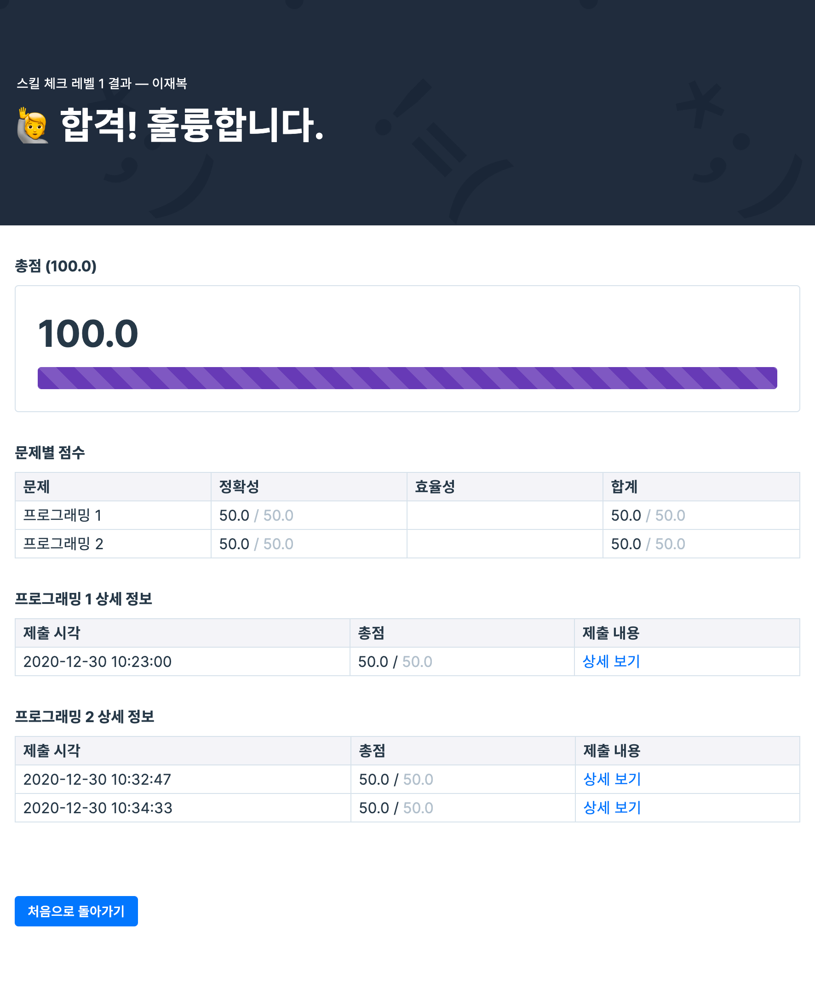

# Homework #1

## SKill Check 레벨1 획득


## 작성코드
### [문제 1. 최대공약수와 최소공배수](https://github.com/Tezla-Lee/Algorithm/blob/master/FastCampus/src/level1/p1_%EC%B5%9C%EB%8C%80%EA%B3%B5%EC%95%BD%EC%88%98_%EC%B5%9C%EC%86%8C%EA%B3%B5%EB%B0%B0%EC%88%98/Solution.java)
```java
package level1.p1_최대공약수_최소공배수;

class Solution {
    public int[] solution(int n, int m) {
        int[] answer = new int[2];
        int min = Math.min(n, m);
        int gcd = 1;
        for (int i = 1; i <= min ; i++) {
            if (n % i == 0 && m % i == 0) {
                gcd = i;
            }
        }
        answer[0] = gcd;
        answer[1] = m * n / gcd;
        return answer;
    }
}
```

### [문제 2. 배열에서 가장 작은 수 제거](https://github.com/Tezla-Lee/Algorithm/blob/master/FastCampus/src/level1/p2_%EC%B5%9C%EC%86%8C%EC%88%98%EC%A0%9C%EA%B1%B0/Solution.java)
```java
package level1.p2_최소수제거;

import java.util.ArrayList;

class Solution {
    public int[] solution(int[] arr) {
        int min = Integer.MAX_VALUE;
        int minIndex = 0;
        ArrayList<Integer> arrayList = new ArrayList<>();

        for (int i = 0; i < arr.length; i++) {
            if (min > arr[i]) {
                min = arr[i];
                minIndex = i;
            }
            arrayList.add(arr[i]);
        }

        arrayList.remove(minIndex);

        int[] answer = new int[arrayList.size()];
        for (int i = 0; i < answer.length; i++) {
            answer[i] = arrayList.get(i);
        }

        if (answer.length == 0) {
            return new int[]{-1};
        }

        return answer;
    }
}
```